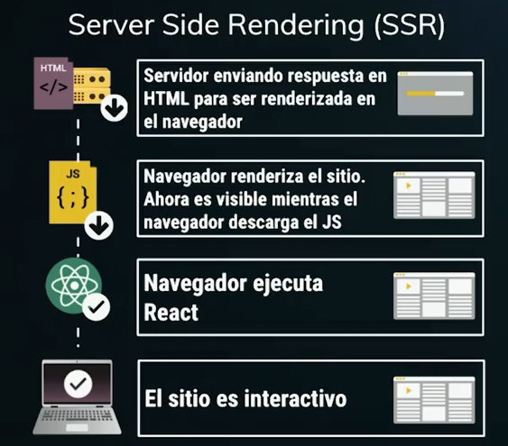

# que es SSR?

## Client Side Rendering (CSR)

Es lo habitual, el navegador descarga la aplicación y una vez procesada se presenta. Lo cual puede tomar algún tiempo en suceder y aburrir al usuario.

## Server Side Rendering (SSR)

Es un proceso similar, pero entre los datos que envía el servidor hay un pre renderizado de la aplicación en un String el cual se interpreta como HTML para ofrecerle una preview al usuario.

## Las ventajas de SSR son:

- Hace que la primera carga sea mas rapida.
- Mejora el SEO.
- Look and Feel --> No pasa de una pantalla en blanco a de repente toda la aplicación, sino que con un primer renderizado se va gradualmente haciendo interactiva.
